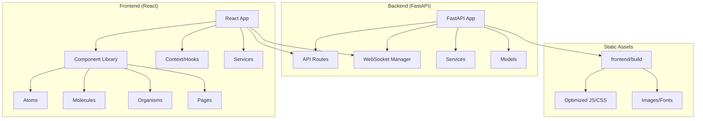

# Design Document

## Overview

This design document outlines the technical approach for completing the web application optimization project based on the existing Web-App-Improve tasks. The design focuses on finishing the React migration, eliminating duplicate files, fixing deployment errors, and implementing the remaining performance optimizations while working with the current project structure.

The project builds upon the existing foundation:
- React 18.2.0 with component-based architecture
- Tailwind CSS for responsive design
- Atomic design component library (atoms, molecules, organisms)
- FastAPI backend serving React build from frontend/build
- WebSocket implementation for real-time features

## Architecture

### Current Architecture Analysis

The application currently uses a hybrid architecture:
- **Backend**: FastAPI (Python) serving API endpoints and static files
- **Frontend**: React SPA with Tailwind CSS, served from frontend/build
- **Database**: SQLAlchemy with SQLite/PostgreSQL
- **Real-time**: WebSocket implementation via websocket_manager.py
- **Authentication**: JWT-based with secure token handling

### Target Architecture

The optimized architecture will maintain the current structure while:
1. Completing React component migration from HTML templates
2. Eliminating duplicate files and consolidating functionality
3. Fixing module import errors and build pipeline issues
4. Implementing remaining performance optimizations



## Components and Interfaces

### Component Migration Strategy

Based on the existing templates directory, the following components need migration:

#### High Priority Templates (Active in main.py)
- `base_layout.html` → `BaseLayout.js` (template)
- `dashboard.html` → `DashboardPage.js` (already exists, needs completion)
- `login.html` → `LoginPage.js` (already exists)
- `chat_interface.html` → `ChatPage.js` (already exists, needs enhancement)

#### Medium Priority Templates
- `admin.html` → `AdminPage.js`
- `billing.html` → `BillingPage.js`
- `numbers.html` → `NumbersPage.js`
- `verifications.html` → `VerificationsPage.js`

#### Low Priority Templates (Legacy/Unused)
- Templates not referenced in current API routes can be deprecated

### Component Interface Design

```typescript
// Base interfaces for component props
interface BaseComponentProps {
  className?: string;
  children?: React.ReactNode;
}

interface PageProps extends BaseComponentProps {
  user?: User;
  loading?: boolean;
}

interface FormProps extends BaseComponentProps {
  onSubmit: (data: any) => void;
  validation?: ValidationSchema;
}
```

### Existing Component Library Enhancement

The current atomic design structure will be enhanced:

#### Atoms (Existing + New)
- `Button.js` ✅ (exists)
- `Input.js` ✅ (exists) 
- `LoadingSpinner.js` ✅ (exists)
- `Badge.js` (new)
- `Avatar.js` (new)
- `Icon.js` (new)

#### Molecules (Existing + New)
- `FormField.js` ✅ (exists)
- `NotificationToast.js` ✅ (exists)
- `PasswordStrengthMeter.js` ✅ (exists)
- `SearchBar.js` ✅ (exists)
- `DataTable.js` (new)
- `Modal.js` (new)

#### Organisms (Existing + New)
- `Header.js` ✅ (exists)
- `Sidebar.js` ✅ (exists)
- `ChatInterface.js` (new)
- `DashboardWidget.js` (new)

## Data Models

### Frontend State Management

Using React Context API for global state:

```javascript
// AuthContext - existing, needs enhancement
const AuthContext = {
  user: User | null,
  isAuthenticated: boolean,
  loading: boolean,
  login: (credentials) => Promise<void>,
  logout: () => void
}

// NotificationContext - existing
const NotificationContext = {
  notifications: Notification[],
  addNotification: (notification) => void,
  removeNotification: (id) => void
}

// New contexts needed
const WebSocketContext = {
  socket: WebSocket | null,
  isConnected: boolean,
  sendMessage: (message) => void,
  subscribe: (event, callback) => void
}

const ThemeContext = {
  theme: 'light' | 'dark',
  toggleTheme: () => void
}
```

### API Integration Models

Maintain existing API structure while adding TypeScript interfaces:

```typescript
interface User {
  id: string;
  username: string;
  email: string;
  is_active: boolean;
  created_at: string;
}

interface Message {
  id: string;
  conversation_id: string;
  sender_id: string;
  content: string;
  message_type: string;
  created_at: string;
}

interface ApiResponse<T> {
  success: boolean;
  data?: T;
  error?: string;
  message?: string;
}
```

## Error Handling

### Build Error Resolution Strategy

Common deployment errors to fix:

1. **Module Import Errors**
   - Fix relative import paths in React components
   - Ensure all dependencies are properly installed
   - Resolve circular dependency issues

2. **Static Asset Serving**
   - Verify FastAPI static file mounting configuration
   - Ensure frontend/build directory structure is correct
   - Fix asset path references in HTML

3. **WebSocket Connection Issues**
   - Implement proper error handling in WebSocket connections
   - Add reconnection logic for dropped connections
   - Handle authentication failures gracefully

### Frontend Error Boundaries

```javascript
class ErrorBoundary extends React.Component {
  constructor(props) {
    super(props);
    this.state = { hasError: false, error: null };
  }

  static getDerivedStateFromError(error) {
    return { hasError: true, error };
  }

  componentDidCatch(error, errorInfo) {
    console.error('Error caught by boundary:', error, errorInfo);
    // Send to error reporting service
  }

  render() {
    if (this.state.hasError) {
      return <ErrorPage error={this.state.error} />;
    }
    return this.props.children;
  }
}
```

## Testing Strategy

### Component Testing
- Use existing Jest + React Testing Library setup
- Test atomic components in isolation
- Test page components with mocked dependencies
- Test context providers and custom hooks

### Integration Testing
- Test API integration with mock servers
- Test WebSocket functionality with mock connections
- Test routing and navigation flows

### Performance Testing
- Lighthouse audits for performance metrics
- Bundle size analysis with webpack-bundle-analyzer
- Load testing for API endpoints

## Performance Optimization Implementation

### Asset Optimization (Task 1.4)

```javascript
// webpack.config.js enhancements
module.exports = {
  optimization: {
    splitChunks: {
      chunks: 'all',
      cacheGroups: {
        vendor: {
          test: /[\\/]node_modules[\\/]/,
          name: 'vendors',
          chunks: 'all',
        },
      },
    },
  },
  plugins: [
    new CompressionPlugin({
      algorithm: 'gzip',
      test: /\.(js|css|html|svg)$/,
    }),
  ],
};
```

### Image Optimization
- Implement lazy loading for images
- Use WebP format with fallbacks
- Implement responsive image loading with srcset

### Caching Strategy
```javascript
// Service worker for caching
const CACHE_NAME = 'cumapp-v1';
const urlsToCache = [
  '/',
  '/static/css/main.css',
  '/static/js/main.js',
];

self.addEventListener('install', (event) => {
  event.waitUntil(
    caches.open(CACHE_NAME)
      .then((cache) => cache.addAll(urlsToCache))
  );
});
```

## Security Implementation

### Content Security Policy
```python
# FastAPI middleware for CSP headers
@app.middleware("http")
async def add_security_headers(request: Request, call_next):
    response = await call_next(request)
    response.headers["Content-Security-Policy"] = (
        "default-src 'self'; "
        "script-src 'self' 'unsafe-inline'; "
        "style-src 'self' 'unsafe-inline'; "
        "img-src 'self' data: https:; "
        "connect-src 'self' ws: wss:;"
    )
    return response
```

### Input Sanitization
- Client-side validation with react-hook-form
- Server-side validation with Pydantic models
- XSS prevention with DOMPurify for rich text

## Deployment Configuration

### Build Pipeline Optimization
```json
{
  "scripts": {
    "build": "react-scripts build",
    "build:analyze": "npm run build && npx webpack-bundle-analyzer build/static/js/*.js",
    "test:coverage": "react-scripts test --coverage --watchAll=false"
  }
}
```

### FastAPI Static File Configuration
```python
# Optimized static file serving
app.mount("/static", StaticFiles(directory="frontend/build/static"), name="static")
app.mount("/", StaticFiles(directory="frontend/build", html=True), name="frontend")

# Add cache headers for static assets
@app.middleware("http")
async def add_cache_headers(request: Request, call_next):
    response = await call_next(request)
    if request.url.path.startswith("/static/"):
        response.headers["Cache-Control"] = "public, max-age=31536000"
    return response
```

## Migration Plan

### Phase 1: Cleanup and Stabilization
1. Identify and remove duplicate files/folders
2. Fix module import errors and build issues
3. Complete responsive design testing
4. Implement error boundaries and proper error handling

### Phase 2: Component Migration
1. Migrate remaining HTML templates to React components
2. Enhance existing components with missing features
3. Implement WebSocket integration in React components
4. Add proper TypeScript interfaces

### Phase 3: Performance and Security
1. Implement asset optimization and caching
2. Add security headers and input sanitization
3. Complete accessibility audit and fixes
4. Implement comprehensive testing

### Phase 4: Advanced Features
1. Add internationalization support
2. Implement advanced dashboard features
3. Enhance chat functionality with rich text
4. Add push notifications and PWA features

This design maintains compatibility with the existing codebase while providing a clear path to complete the optimization project outlined in the Web-App-Improve tasks.